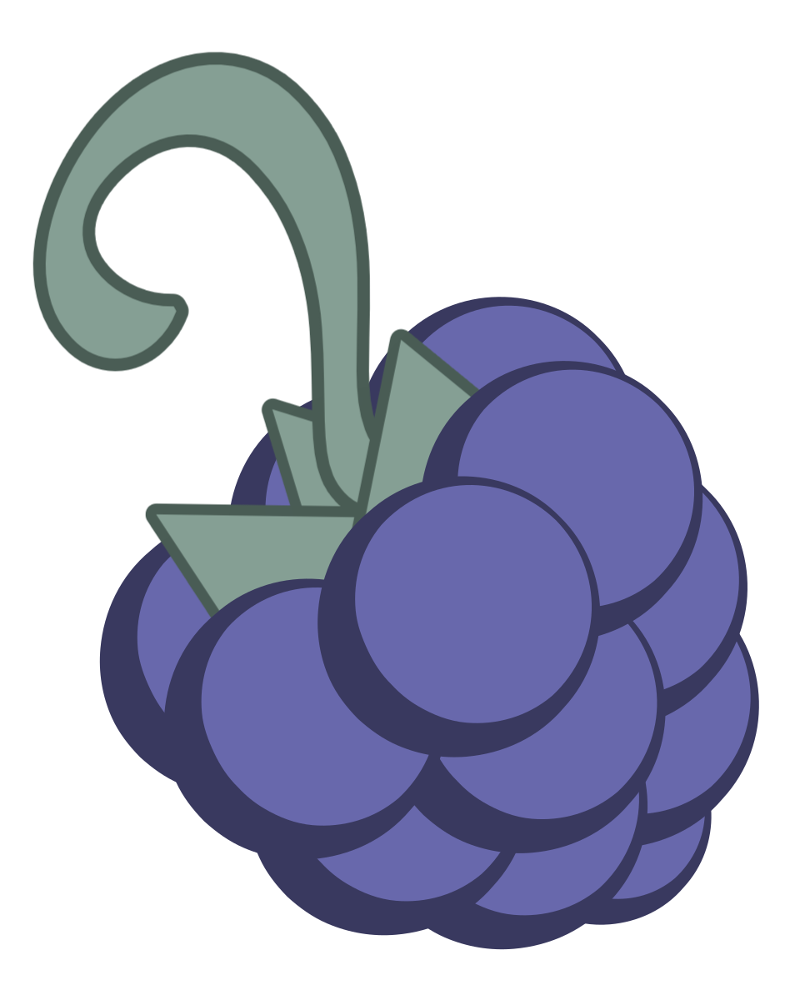

<div align="center">


# Enigmora Monimen Framework

**Documentation Governance for AI-Assisted Software Development**

[](LICENSE)
[](CONTRIBUTING.md)
[](ADOPTION-GUIDE.md)
[](https://enigmora.com)

[Getting Started](#getting-started) •
[Features](#features) •
[Documentation](#documentation) •
[Contributing](#contributing)

**Languages**: English | [Español](i18n/es/README.md)

</div>

---

## The Problem

As AI coding assistants become integral to software development, a critical gap emerges:

- **Who made this change?** Was it a developer or an AI assistant?
- **Why was this decision made?** What alternatives were considered?
- **Should this have been reviewed?** Was human oversight appropriate?
- **What's the impact?** How risky is this change?

Without structured documentation, AI-assisted development becomes a black box.

## The Solution

Enigmora Monimen Framework provides a **documentation governance system** that ensures:

> **"No significant change without a documented trace."**

Every meaningful change—whether by human or AI—is documented, attributed, and reviewable.

---

## Features

### 📋 Structured Documentation

Eight document types covering the full development lifecycle:

| Type | Purpose | Example |
|------|---------|---------|
| **REQ** | Requirements | System requirements, user stories |
| **ADR** | Architecture Decisions | Technology choices, design patterns |
| **TES** | Test Plans | Test strategies, coverage goals |
| **INC** | Incident Post-mortems | Root cause analysis, lessons learned |
| **TDE** | Technical Debt | Identified debt, remediation plans |
| **AILOG** | AI Action Logs | What AI assistants did and why |
| **AIDEC** | AI Decisions | Choices made by AI with alternatives |
| **ETH** | Ethical Reviews | Privacy, bias, responsible AI |

### 🤖 AI Agent Support

Pre-configured for popular AI coding assistants:

- **Claude Code** (Anthropic) → `CLAUDE.md`
- **Cursor** → `.cursorrules`
- **GitHub Copilot CLI** → `.github/copilot-instructions.md`
- **Gemini CLI** (Google) → `GEMINI.md`

Each configuration instructs the AI to:
- Identify itself in every document
- Declare confidence levels
- Request human review when appropriate
- Follow naming conventions

### 👁️ Human Oversight

Built-in safeguards ensure humans stay in control:

- **Autonomy levels**: Some document types require human approval
- **Review triggers**: Low confidence or high risk → mandatory review
- **Ethical reviews**: Privacy and bias concerns flagged for human decision

### ✅ Validation & CI/CD

Automated validation tools:

- **Pre-commit hooks** (Bash) - Validate before commit
- **PowerShell script** - Windows-friendly validation
- **GitHub Actions** - PR validation workflow

---

## Getting Started

### Quick Start (New Project)

**Option 1: Use as Template** (Recommended)

Click the **"Use this template"** button above to create a new repository with Enigmora Monimen Framework pre-configured.

**Option 2: Clone and Copy**

```bash
# Clone Enigmora Monimen Framework
git clone https://github.com/enigmora/monimen-framework.git

# Copy to your project
cp -r monimen-framework/.monimen your-project/
cp monimen-framework/CLAUDE.md your-project/
cp monimen-framework/GEMINI.md your-project/
cp monimen-framework/.cursorrules your-project/
cp -r monimen-framework/.github your-project/
cp -r monimen-framework/scripts your-project/
```

### Quick Start (Existing Project)

```bash
# Download Enigmora Monimen Framework
git clone https://github.com/enigmora/monimen-framework.git monimen-temp

# Copy without overwriting (Linux/Mac)
cp -rn monimen-temp/.monimen ./
cp -n monimen-temp/CLAUDE.md ./
cp -n monimen-temp/GEMINI.md ./
cp -n monimen-temp/.cursorrules ./
cp -rn monimen-temp/.github ./
cp -rn monimen-temp/scripts ./

# Clean up
rm -rf monimen-temp

# Commit
git add .monimen/ CLAUDE.md GEMINI.md .cursorrules .github/ scripts/
git commit -m "chore: adopt Enigmora Monimen Framework"
```

📖 **See [ADOPTION-GUIDE.md](ADOPTION-GUIDE.md) for detailed instructions, migration strategies, and team rollout plans.**

---

## Documentation

### Quick Reference

```
.monimen/
├── 00-governance/           # Policies and rules
├── 01-requirements/         # REQ documents
├── 02-design/decisions/     # ADR documents
├── 03-implementation/       # Implementation guides
├── 04-testing/              # TES documents
├── 05-operations/incidents/ # INC documents
├── 06-evolution/technical-debt/ # TDE documents
├── 07-ai-audit/
│   ├── agent-logs/          # AILOG documents
│   ├── decisions/           # AIDEC documents
│   └── ethical-reviews/     # ETH documents
└── templates/               # Document templates
```

### Naming Convention

```
[TYPE]-[YYYY-MM-DD]-[NNN]-[description].md
```

Example: `ADR-2025-01-27-001-use-postgresql-for-persistence.md`

### Key Documents

| Document | Description |
|----------|-------------|
| [ADOPTION-GUIDE.md](ADOPTION-GUIDE.md) | Comprehensive adoption guide |
| [.monimen/QUICK-REFERENCE.md](.monimen/QUICK-REFERENCE.md) | One-page reference card |
| [.monimen/00-governance/PRINCIPLES.md](.monimen/00-governance/PRINCIPLES.md) | Guiding principles |
| [.monimen/00-governance/AGENT-RULES.md](.monimen/00-governance/AGENT-RULES.md) | Rules for AI agents |

---

## How It Works

### 1. AI Makes a Change

An AI assistant working on your code automatically:

```yaml
# Creates: .monimen/07-ai-audit/agent-logs/AILOG-2025-01-27-001-implement-auth.md
---
id: AILOG-2025-01-27-001
title: Implement JWT authentication
agent: claude-code-v1.0
confidence: high
risk_level: high
review_required: true
---
```

### 2. Human Reviews (When Needed)

High-risk or low-confidence changes are flagged:

```
📋 AILOG-2025-01-27-001-implement-auth.md
   Agent: claude-code-v1.0
   Confidence: high
   Risk Level: high ⚠️
   Review Required: YES
```

### 3. Decisions Are Preserved

When choosing between alternatives, decisions are documented:

```yaml
# Creates: .monimen/07-ai-audit/decisions/AIDEC-2025-01-27-001-auth-strategy.md
---
id: AIDEC-2025-01-27-001
title: Choose JWT over session-based auth
alternatives_considered:
  - JWT tokens (chosen)
  - Session cookies
  - OAuth only
justification: "Stateless architecture requirement..."
---
```

### 4. Ethical Concerns Are Flagged

When AI encounters ethical considerations:

```yaml
# Creates: .monimen/07-ai-audit/ethical-reviews/ETH-2025-01-27-001-user-data.md
---
id: ETH-2025-01-27-001
title: User data collection scope
status: draft  # Requires human approval
review_required: true
concerns:
  - GDPR compliance
  - Data minimization
---
```

---

## Validation

### Pre-commit Hook

```bash
# Install the pre-commit hook
cp scripts/pre-commit-docs.sh .git/hooks/pre-commit
chmod +x .git/hooks/pre-commit
```

### Manual Validation

```bash
# Linux/Mac
bash scripts/pre-commit-docs.sh

# Windows PowerShell
.\scripts\validate-docs.ps1
```

### GitHub Actions

The included workflow (`.github/workflows/docs-validation.yml`) automatically validates:
- File naming conventions
- Required metadata fields
- Sensitive information detection
- Markdown formatting
- Internal link integrity

---

## Skills

Monimen Framework includes skills for AI agents that enable **active documentation creation**.

> **Binary System**: Monimen uses a passive system (agents auto-document via context instructions) and an active system (users invoke skills to create documentation manually or when the agent missed something).

### Available Skills

| Skill | Purpose | Claude | Gemini |
|-------|---------|--------|--------|
| `/monimen-status` | Check documentation compliance | ✅ | ✅ |
| `/monimen-new` | Create any document type (unified) | ✅ | ✅ |
| `/monimen-ailog` | Quick AILOG creation | ✅ | ✅ |
| `/monimen-aidec` | Quick AIDEC creation | ✅ | ✅ |
| `/monimen-adr` | Quick ADR creation | ✅ | ✅ |

### Usage Examples

```bash
# Check documentation status
/monimen-status

# Create documentation (agent suggests type)
/monimen-new

# Force specific document type
/monimen-new ailog

# Direct shortcuts
/monimen-ailog
/monimen-aidec
/monimen-adr
```

### Shell Scripts (Manual Use)

For users who prefer command-line or use agents without skill support:

```bash
# Interactive document creation
./scripts/monimen-new.sh

# Create specific type directly
./scripts/monimen-new.sh ailog

# Check documentation status
./scripts/monimen-status.sh
```


### Agent Reporting

AI agents report documentation status at the end of each task:

| Status | Meaning |
|--------|---------|
| `Monimen: Created AILOG-...` | Documentation was created |
| `Monimen: No documentation required` | Change was minor (<10 lines) |
| `Monimen: Documentation pending` | May need manual review |

### Multi-Agent Architecture

Monimen Framework provides native skill support for multiple AI agents through a layered architecture:

```
your-project/
├── .agent/workflows/       # 🌐 Agnostic (Antigravity, future agents)
│   ├── monimen-new.md
│   ├── monimen-status.md
│   └── ...
├── .gemini/skills/         # 🔵 Gemini CLI (Google)
│   ├── monimen-new/SKILL.md
│   └── ...
└── .claude/skills/         # 🟣 Claude Code (Anthropic)
    ├── monimen-new/SKILL.md
    └── ...
```

| Directory | Agent | Product | Format |
|-----------|-------|---------|--------|
| `.agent/workflows/` | Antigravity, generic | VS Code/Cursor extensions | `skill-name.md` with YAML frontmatter |
| `.gemini/skills/` | Gemini CLI | Google's terminal CLI | `skill-name/SKILL.md` |
| `.claude/skills/` | Claude Code | Anthropic's coding agent | `skill-name/SKILL.md` |

> **Note**: `.agent/` is the **vendor-agnostic** standard. Agent-specific directories (`.gemini/`, `.claude/`) provide compatibility for those platforms while following their native conventions.

All skill implementations are **functionally identical**—only the format differs to match each agent's requirements.

---

## Supported Platforms

### AI Coding Assistants

| Platform | Config File | Status |
|----------|-------------|--------|
| Claude Code | `CLAUDE.md` | ✅ Full support |
| Cursor | `.cursorrules` | ✅ Full support |
| GitHub Copilot CLI | `.github/copilot-instructions.md` | ✅ Full support |
| Gemini CLI | `GEMINI.md` | ✅ Full support |

### Operating Systems

| OS | Validation Script |
|----|-------------------|
| Linux | `scripts/pre-commit-docs.sh` |
| macOS | `scripts/pre-commit-docs.sh` |
| Windows | `scripts/validate-docs.ps1` |

### CI/CD Platforms

| Platform | Support |
|----------|---------|
| GitHub Actions | ✅ Included workflow |
| GitLab CI | 🔧 Adaptable from GitHub Actions |
| Azure DevOps | 🔧 Adaptable from GitHub Actions |

---

## Standards Alignment

Enigmora Monimen Framework aligns with:

- **ADR** (Architecture Decision Records) - Native support
- **IEEE 830** - Requirements documentation structure
- **ISO/IEC 25010** - Quality attributes in ADRs
- **GDPR** - Privacy impact documentation (ETH)
- **EU AI Act** - AI transparency and human oversight
- **NIST AI RMF** - Risk documentation

---

## Contributing

We welcome contributions! See [CONTRIBUTING.md](CONTRIBUTING.md) for guidelines.

### Ways to Contribute

- 🐛 Report bugs
- 💡 Suggest features
- 📖 Improve documentation
- 🔧 Submit pull requests
- 🌍 Add translations

---

## License

This project is licensed under the MIT License - see the [LICENSE](LICENSE) file for details.

---

## About Enigmora

<div align="center">



**[Enigmora](https://enigmora.com)** builds tools for responsible AI-assisted software development.

[Website](https://enigmora.com) • [GitHub](https://github.com/enigmora)

</div>

---

<div align="center">

**Enigmora Monimen Framework** — Because every change tells a story.

[⬆ Back to top](#enigmora-monimen-framework)

</div>
